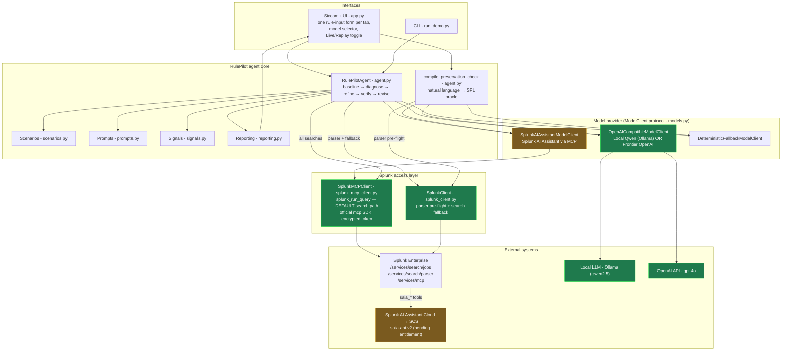
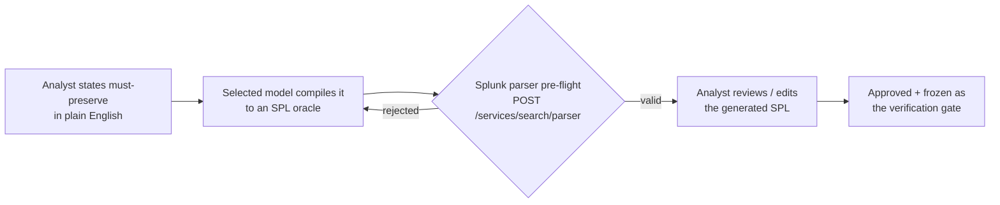
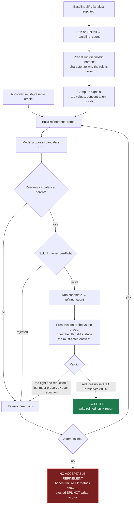

# RulePilot — Architecture

RulePilot is an **analyst-in-the-loop agent** that reduces false positives in noisy
Splunk detection rules **without dropping the events analysts flag as must-catch**.
The analyst supplies a noisy rule and states — in plain English — what it must
never stop catching. RulePilot diagnoses *why* the rule is noisy, proposes a
tighter rule, and **proves** the tighter rule still surfaces the must-catch
behavior before accepting it. The LLM is a pluggable provider; Splunk is the
source of ground truth.

- **Track:** Security (detection engineering / SOC alert-fatigue reduction)
- **Interfaces:** Streamlit UI (`app.py`) and CLI (`run_demo.py`)
- **Splunk AI capability used at runtime:** the **Splunk MCP Server**
  (Splunkbase #7931) — every Splunk search runs through it. The **Splunk AI
  Assistant** is also integrated as a model provider (pending tenant
  entitlement).

### What this diagram shows (maps to the submission requirements)

| Requirement | Where |
|---|---|
| **How the app interacts with Splunk** | §1 (Splunk access layer) + §4 (integration table): all searches run through the **Splunk MCP Server** (`splunk_run_query`); REST handles parser pre-flight + fallback |
| **How AI models / agents are integrated** | §1 (model-provider block), §2 (natural-language → SPL compiler), §5 (provider-agnostic `ModelClient`, incl. the Splunk AI Assistant) |
| **Data flow between services, APIs, and components** | §1 (component graph) and §3 (the agentic refine → verify → revise loop) |

---

## 1. System architecture

How the pieces fit together, and where Splunk and the swappable models plug in.

**Splunk MCP Server is the default data path:** every search RulePilot runs —
baseline, diagnostics, candidates, and the preservation checks — goes through the
**Splunk MCP Server** (`splunk_run_query`), one of the hackathon's listed Splunk
AI capabilities. The REST client handles SPL parser pre-flight (there is no
parser tool in MCP) and serves as a search fallback if MCP is briefly
unreachable, so a run never fails.

**Legend:** green = working in the demo today; amber = wired and demonstrable
(the MCP tool list includes `saia_*`) but blocked on a Splunk-cloud-side
`saia-api-v2` entitlement for the tenant. The model layer is the `ModelClient`
protocol, so the provider is a runtime choice — the analyst selects
**Local (Qwen)**, **Frontier (OpenAI)**, or **Splunk AI Assistant** in the UI,
and the same code path uses whichever is chosen.

---

## 2. The analyst's inputs and the natural-language → SPL compiler

Every entry point uses **one shared rule-input form**. The analyst provides a
**baseline SPL**, a plain-English **context**, and a plain-English
**must-preserve** statement. The two worked examples pre-fill the form to show
what good inputs look like; the Custom tab starts blank. The analyst never has
to hand-write the verification SPL — they describe the intent and the selected
model compiles it, then they review and approve it.

The compiled oracle is generated once and **frozen with the analyst's
approval** before the refinement loop runs — so the gate stays an *independent*
check on the refinement, not the model grading its own work.

---

## 3. Data flow — the agentic refinement loop

The core loop. Every step that touches Splunk is grounded in live data or
Splunk's own SPL parser. The **preservation gate** — testing the candidate
against the approved oracle — is what makes this a verification-first agent
rather than a generate-only one.

> Diagnostics characterize the matched event population (top values per field,
> time-window bursts, benign-vs-suspicious ratios). The model plans them from
> the baseline; the two worked examples additionally ship a curated set for
> reproducibility. Either way they are read-only and parser-validated before
> they run.

---

## 4. Splunk integration points

| Capability | Mechanism | Endpoint / tool |
|---|---|---|
| **Run every search** (baseline, diagnostics, candidates, preservation checks) — the default data path | **Splunk MCP Server** | `splunk_run_query` tool over `/services/mcp` (official `mcp` SDK, encrypted token) |
| **SPL grammar pre-flight** (reject bad SPL before dispatch; feed Splunk's own error back to the model) | REST parser | `POST /services/search/parser?parse_only=true` |
| Search fallback if MCP is briefly unreachable | REST search jobs | `POST /services/search/jobs` → poll → `/results` |
| AI Assistant as a model provider | MCP `saia_*` tools | `saia_generate_spl` (→ `saia-api-v2`, pending entitlement) |

---

## 5. Model integration — provider-agnostic by design

All model access goes through the `ModelClient` protocol (`generate_json`), so
the same agent and compiler code runs against any provider:

- **Local (Qwen)** — `qwen2.5` via Ollama's OpenAI-compatible API. Offline, no
  keys.
- **Frontier (OpenAI)** — e.g. `gpt-4o` via the OpenAI API. Strongest
  natural-language → SPL fidelity; used in the demo.
- **Splunk AI Assistant** — routes through `saia_generate_spl` over MCP for
  native SPL fluency. Wired and surfaces backend errors honestly; activates the
  moment the tenant's `saia-api-v2` entitlement is enabled.

The analyst picks the provider in the UI. A misconfigured or unreachable
provider (no API key, local LLM down, AI Assistant not entitled) surfaces a
clear error rather than failing silently — the agent's value (diagnosis, the
Splunk-parser pre-flight, the preservation gate) is independent of which model
writes the SPL.

---

## 6. Honest-by-construction guarantees

- A refined `.spl` file is **written to disk only when a candidate is accepted**;
  rejected attempts never overwrite the rule.
- When no candidate passes, the UI shows `—` (never a fabricated "100%
  reduction") and labels the last attempt as *not accepted*.
- The must-preserve oracle is generated from the analyst's intent and **approved
  before** the loop runs, keeping the verification gate independent.
- Refined SPL targets the **same index** as the baseline — no silent index or
  sourcetype mutation. Scope is strictly **false-positive reduction**, never
  coverage expansion.
